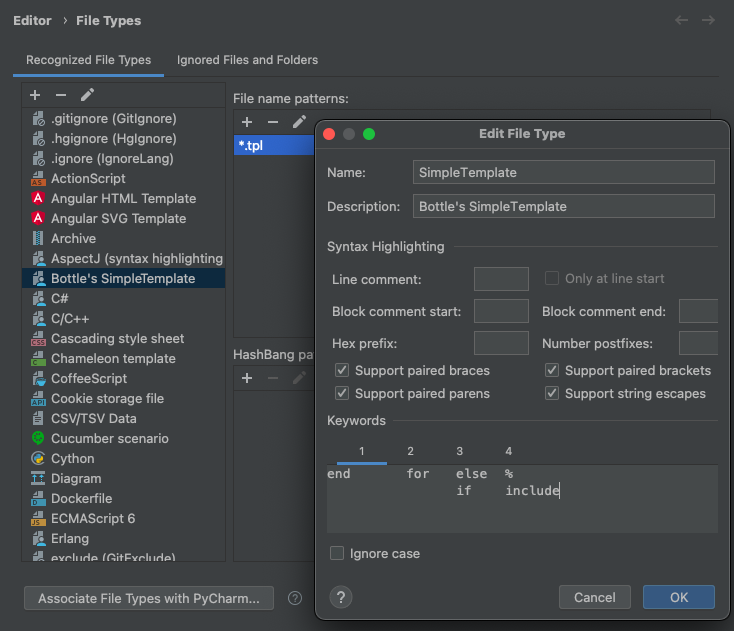
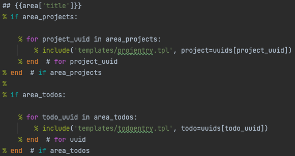

## Colorize SimpleTemplate code in PyCharm
When a template become long enough, it can be hard on your eyes.

The following configuration for PyCharm is no substitute for proper
syntax highlighting, but nonetheless help in making sense of what is
code and what is markup.

Here's an example of the resulting colorized output:

